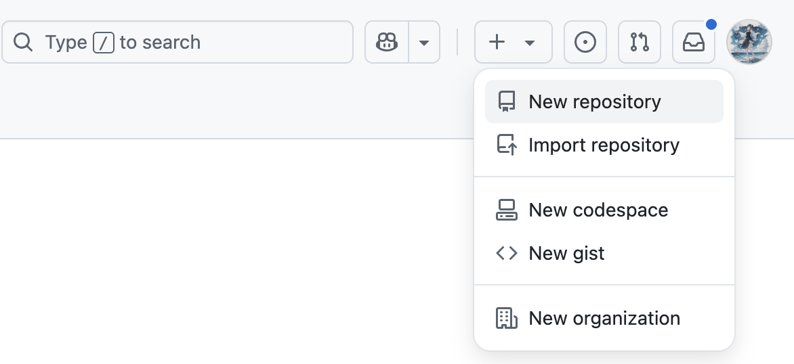
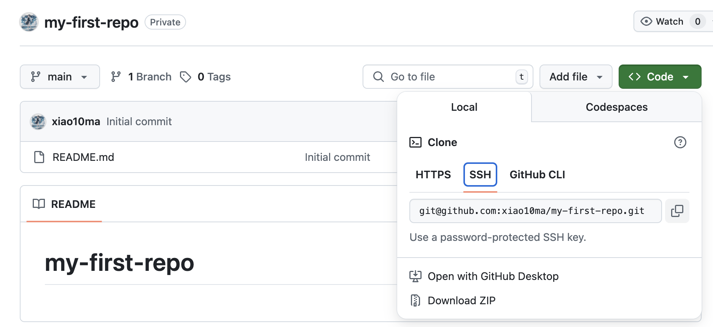
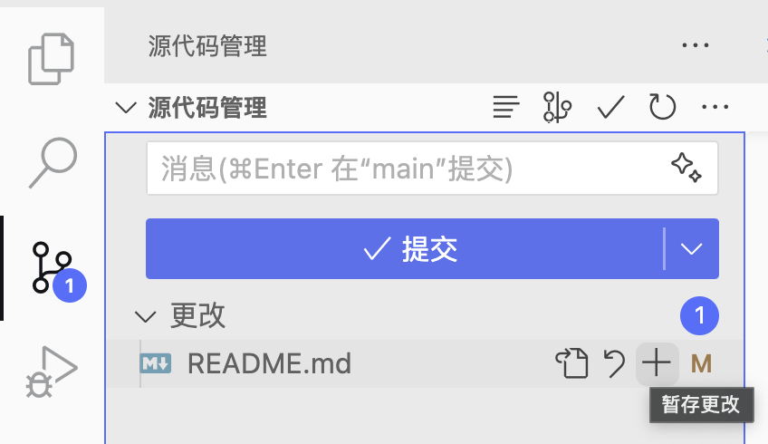

<h1 align="center">AI服务器极简入门 Easy-AI-Server</h1>

<p align="center"> </p>

> 本文将综合介绍AI科研服务器的一些工具的使用，供大家入门。如果在学习过程中，遇到一些问题，可以问问GPT/Deepseek这类AI工具或Google。若文章有错误，欢迎提issue指正 :D

# Contents - 目录

<nav>
  <ul>
    <li><a href="#-linux-常用命令与基础知识">1. Linux 常用命令与基础知识 - Basic Linux Commands</a>
      <ul>
        <li><a href="#-一远程登录">1.1 远程登录 - Remote Login</a></li>
        <li><a href="#-二文件与目录操作">1.2 文件与目录操作 - File Operations</a></li>
        <li><a href="#-三服务器资源查看">1.3 服务器资源查看 - Resource Monitoring</a></li>
        <li><a href="#-四实用技巧">1.4 实用技巧 - Useful Tips</a></li>
      </ul>
    </li>
    <li><a href="#-git-与-github-使用简明指南">2. Git 与 GitHub 使用简明指南 - Git & GitHub Guide</a>
      <ul>
        <li><a href="#-一git-是什么">2.1 Git 是什么？ - What is Git?</a></li>
        <li><a href="#-二github-是什么">2.2 GitHub 是什么？ - What is GitHub?</a></li>
        <li><a href="#-三常见-git-命令">2.3 常见 Git 命令 - Common Git Commands</a></li>
        <li><a href="#-如何连接-github">2.4 如何连接 GitHub - GitHub Connection</a></li>
        <li><a href="#-git-项目典型工作流程">2.5 Git 项目典型工作流程 - Git Workflow</a></li>
      </ul>
    </li>
    <li><a href="#-anaconda--miniconda-安装与配置">3. Anaconda/Miniconda 安装与配置 - Installation & Setup</a>
      <ul>
        <li><a href="#-一安装位置建议">3.1 安装位置建议 - Installation Location</a></li>
        <li><a href="#-二安装步骤以-miniconda-为例">3.2 安装步骤 - Installation Steps</a></li>
        <li><a href="#-三加速安装配置国内镜像源">3.3 加速安装：配置国内镜像源 - Speed Up with Mirrors</a></li>
      </ul>
    </li>
    <li><a href="#-hugging-face-配置">4. Hugging Face 配置 - Hugging Face Setup</a></li>
  </ul>
</nav>

## 🐧 Linux 常用命令与基础知识

为便于说明，以下示例中使用了通用占位符，如 {username}、{dirname} 等，表示你需要根据自己的实际情况进行替换。例如，如果你的用户名是 mazipei，则应将 {username} 替换为 mazipei。

为提升可读性，我会用花括号 {} 标注需要替换的内容，请根据实际情况进行修改。

### 🌐 一、远程登录

```
ssh {username}@{ip}
# example: ssh mazipei@10.10.10.10
```

如果没有设置过钥匙，第一次登陆时通常会有：

```bash
❯ ssh mazipei@10.10.10.10
no such identity: /Users/mazipei/.ssh/id_rsa: No such file or directory
mazipei@10.28.5.13's password:
```

输入密码即可（linux在输入密码时不会显示）

<details>
<summary>（可选）服务器免密登陆</summary>

每次登录服务器都需要输入密码，比较麻烦。可以通过设置 SSH 密钥实现免密登录：

1. 在本地生成 SSH 密钥对

   ```bash
   ssh-keygen -t rsa -b 4096 -C {"your_email@example.com"}

   # example: ssh-keygen -t rsa -b 4096 -C 123456@qq.com
   ```

   回车后系统会提示你保存路径，默认是：

   ```
   /Users/{username}/.ssh/id_rsa
   ```

   可以直接回车使用默认路径，或者输入你自定义的路径。接着提示你设置密码，可以直接回车跳过。

   生成成功后，会看到两份文件：

   - /Users/{username}/.ssh/id_rsa：私钥（不要泄露）
   - /Users/{username}/.ssh/id_rsa.pub：公钥（可以共享给服务器）
2. 将公钥上传到服务器
   运行以下命令，把公钥追加到服务器的 `/Users/{username}/.ssh/authorized_keys` 文件中：

   ```
   ssh-copy-id {username}@{ip}
   ```

   如果你使用的是自定义密钥路径，可以加 `-i` 参数：

   ```
   ssh-copy-id -i {your_path}/id_rsa.pub {username}@{ip}
   ```
3. 测试免密登录

   ```bash
   ssh {username}@{ip}
   ```

   如果不再提示输入密码，则说明配置成功。

**🧠 附加技巧：多服务器共享一个 SSH 密钥**
如果你有多台服务器，其实无需为每台都生成不同的密钥。只要将同一个公钥添加到每台服务器的 `~/.ssh/authorized_keys` 中，即可通过 同一个私钥实现免密登录多个服务器。
为方便管理和免密登录，可以在本地的 ~/.ssh/config 文件中添加如下配置：

```bash
# ~/.ssh/config

Host {alias1}
    HostName {ip_address1}
    User {username1}
    IdentityFile {private_key_path}

Host {alias2}
    HostName {ip_address2}
    User {username2}
    IdentityFile {private_key_path}
```

例如：

```bash
Host 3090
    HostName 10.10.10.10
    User mazipei
    IdentityFile ~/.ssh/id_rsa

Host 4090
    HostName 10.10.10.11
    User zipeima
    IdentityFile ~/.ssh/id_rsa
```

然后你就可以通过以下命令直接登录：

```
ssh 3090
ssh 4090
```

或者用 VS Code：

https://github.com/user-attachments/assets/4e5686ab-5496-44ee-83c3-c5b160802701

</details>

---

### 📁 二、文件与目录操作

这一部分建议大家可以跟着一起在终端敲一遍。

| 操作         | 命令                    | 说明                                                                                                     |
| ------------ | ----------------------- | -------------------------------------------------------------------------------------------------------- |
| 查看当前路径 | `pwd`                 | 显示当前所在的目录（print working directory）                                                            |
| 列出文件     | `ls`                  | 列出当前目录下的文件和文件夹                                                                             |
| 列出详细信息 | `ls -l`               | 显示包含权限、大小、时间等信息的文件列表                                                                 |
| 切换目录     | `cd {dirname/}`       | 进入某个目录，比如 `cd data/` <br />👉 注意：这里的 `dirname` 是你服务器实际文件夹名字，不是固定写法 |
| 返回上级目录 | `cd ..`               | 返回到当前目录的上一级目录（父目录）                                                                     |
| 当前目录     | `.`                   | 表示当前目录，常用于路径组合或执行脚本，例如 `./run.sh`                                                |
| 上级目录     | `..`                  | 表示当前目录的上一级，例如 `../data/` 表示父目录下的 `data` 文件夹                                   |
| 创建目录     | `mkdir {new_folder/}` | 创建一个文件夹，名字可以自己起<br />👉 例如：`mkdir results`                                           |
| 删除文件     | `rm {file.txt}`       | 删除文件（不可恢复）                                                                                     |
| 删除目录     | `rm -r {folder/}`     | 递归删除目录及其内容                                                                                     |
| 复制文件     | `cp {a.txt} {b.txt}`  | 将 `a.txt` 复制为 `b.txt`                                                                            |
| 移动/重命名  | `mv {a.txt} {b.txt}`  | 改名或移动文件                                                                                           |

<details>
<summary>✏️ 补充：Vim 文件编辑器（最基本用法）</summary>

在服务器中，经常需要快速编辑配置文件或脚本，推荐使用轻量级编辑器 `vim`。

```bash
vim {filename}
# 例如：vim run.sh
```

进入 vim 后，你会看到文件内容，但不能直接输入内容。**Vim 有三个常用模式**：

| 模式     | 功能                 | 如何进入                              |
| -------- | -------------------- | ------------------------------------- |
| 普通模式 | 浏览 / 删除 / 复制等 | 打开 vim 默认就是普通模式             |
| 插入模式 | 输入文本             | 按 `i` 进入插入模式                 |
| 命令模式 | 保存、退出等命令操作 | 按 `Esc` 回到普通模式，再输入 `:` |

#### 常用操作速查：

| 操作         | 命令                | 说明                            |
| ------------ | ------------------- | ------------------------------- |
| 进入插入模式 | `i`               | 开始输入内容                    |
| 退出插入模式 | `Esc`             | 返回普通模式                    |
| 保存并退出   | `:wq` + `Enter` | 写入文件并退出                  |
| 强制退出     | `:q!` + `Enter` | 不保存修改直接退出（⚠️ 慎用） |
| 仅保存       | `:w` + `Enter`  | 保存但不退出                    |

</details>

---

### 🖥 三、服务器资源查看

| 操作                   | 命令                        | 说明                                                                |
| ---------------------- | --------------------------- | ------------------------------------------------------------------- |
| 查看显卡信息           | `nvidia-smi`或 `nvitop` | 查看 GPU 状态；强烈推荐使用 `nvitop`，下文将说明 `nvitop`的安装 |
| 查看CPU信息            | `top`或 `htop`          | 实时查看CPU/内存/进程占用                                           |
| 查看硬盘空间           | `df -h .`                 | 查看各挂载点的磁盘使用                                              |
| 查看当前路径下空间占用 | `du -sh *`                | 各文件/文件夹大小（简洁）                                           |

---

### 🧼 四、实用技巧

* `Tab` 自动补全命令或文件名
* `Ctrl + C` 强制终止当前运行的命令

一般来说，服务器上会有两个常见的工作目录：

1. **用户主目录**：即 `~`，对应路径通常为 `/home/{username}` 或 `/User/{username}`，主要用于存放个人配置文件（如 `.bashrc`、`.ssh/` 等）以及轻量级的数据或脚本。
2. **数据目录**：用于存放数据、代码或实验结果等大型文件。该目录结构在不同实验室的服务器上可能有所不同，建议向实验室同学或管理员确认具体路径。

本文以 `HDD_DISK/users/mazipei` 为例，将其作为数据目录，用于存放项目代码和实验数据等文件。

---

## 🧩 Git 与 GitHub 使用简明指南

### 📌 一、Git 是什么？

Git 是一个**分布式版本控制工具**，用于追踪代码历史、协作开发。简单来说，它可以：

* 记录你对文件做的每一次修改
* 回退到之前的某个状态
* 与别人一起协作开发（配合 GitHub 使用）

---

### ☁️ 二、GitHub 是什么？

GitHub 是一个基于 Git 的**远程代码托管平台**。你可以：

* 把本地代码上传到 GitHub 上备份
* 与他人协作开发项目
* 克隆别人的开源项目到本地使用

---

### 🛠 三、常见 Git 命令

| 操作             | 命令                                    | 说明                        |
| ---------------- | --------------------------------------- | --------------------------- |
| 初始化仓库       | `git init`                            | 在当前目录创建一个 Git 仓库 |
| 克隆项目         | `git clone {repo_url}`                | 下载远程仓库到本地          |
| 查看状态         | `git status`                          | 查看当前修改了哪些文件      |
| 添加文件到暂存区 | `git add {filename}` 或 `git add .` | 将修改加入“待提交”列表    |
| 提交修改         | `git commit -m "提交说明"`            | 提交修改并写入说明          |
| 查看历史记录     | `git log`                             | 查看提交记录                |
| 推送到远程仓库   | `git push`                            | 把本地修改推送到远程仓库    |
| 拉取远程更新     | `git pull`                            | 下载并合并远程仓库的内容    |

这里建议搭配 VS Code 的 Git 可视化功能使用，上述大部分命令在图形界面中都可以轻松完成。

---

### 🌐 使用 SSH 方式连接 GitHub

在开始使用 Git 和 GitHub 之前，我们先来配置 SSH 连接。这样可以避免每次 push 代码时都需要输入用户名和密码，既安全又省心。

#### ✅ 1. 生成 SSH 密钥（服务器端）

```bash
ssh-keygen -t rsa -b 4096 -C "{your_email@example.com}"
```

一路回车，生成 `~/.ssh/id_rsa` 和 `id_rsa.pub`

#### ✅ 2. 添加公钥到 GitHub

1. 登录 GitHub
2. 点击右上角头像 → `Settings`
3. 选择 `SSH and GPG keys` → `New SSH key`
4. 把本地的 `id_rsa.pub` 内容复制进去：

cat 查看`id_rsa.pub`：
```bash
cat ~/.ssh/id_rsa.pub
```

#### ✅ 3. 测试 SSH 连接

```bash
ssh -T git@github.com
```

如果出现 `Hi {username}! You've successfully authenticated, but GitHub does not provide shell access.` 则说明连接成功。

---

### 📝 实战：创建自己的 Git 仓库并上传代码（配合 VS Code 使用）

完成 SSH 配置后，现在我们来创建并使用自己的 Git 仓库：

1. 在Github上创建一个仓库

   - 点击右上角 "➕" → New repository
   - 填写仓库名（比如：`my-first-repo`），可以选择 Public 或 Private
   - 勾选 "Initialize with README"，这样仓库中会有一个初始文件README.md
     
<p align="center"></p>

2. 克隆仓库到本地

   - 点击 "Code" -> "SSH" -> 复制链接（注意：现在我们使用 SSH 链接而不是 HTTPS）
   - 用VS Code连接服务器，在终端执行：

   ```bash
   git clone {repo_url}
   # example: git clone git@github.com:xiao10ma/my-first-repo.git
   ```

<p align="center"></p>

3. 修改文件并上传

   - 修改文件，比如在README.md中添加一行内容
   - 在左侧栏，源代码管理处，点击加号，添加文件到暂存区
   - 写好提交信息（比如：`修改了README文件`），点击"✓提交"
   - 点击 "同步更改" 按钮，将提交内容推送至 GitHub
   - 此时，在GitHub上，可以看到文件被修改了

<p align="center"></p>

---

### 🧠 建议写法：配合 `.gitignore`

为了避免不必要的文件上传到 GitHub（如模型权重、日志文件等），建议你在项目根目录添加 `.gitignore` 文件，例如：

```bash
*.pyc
*.log
*.pt
__pycache__/
checkpoints/
```

---

### 🤔 常见问题

| 问题                             | 解决方式                                            |
| -------------------------------- | --------------------------------------------------- |
| 每次 push 都要输入用户名和密码？ | 建议使用 SSH 密钥                                   |
| 忘了加文件就提交了？             | 用 `git add` 后重新 `git commit --amend`        |
| 提交错了？想回滚？               | `git reset` 或 `git checkout`，建议查阅具体教程 |

---

## 🐍 Anaconda / Miniconda 安装与配置

在服务器上使用 Anaconda（或更轻量的 Miniconda）可以方便地管理 Python 环境和依赖库。由于不同项目通常依赖不同版本的 Python、PyTorch、CUDA 等组件，使用 Conda 环境进行隔离是一种推荐的做法。

### 📦 一、安装位置建议

深度学习项目常常依赖较大的包（如 `torch`、`transformers`、`diffusers` 等），安装体积可能达到数 GB。为了避免占用主目录空间（尤其是 `/home/{username}` 容量较小的情况），**建议将 Conda 安装至数据目录**。

### 🛠 二、安装步骤（以 Miniconda 为例）

1. 下载 Miniconda 安装脚本

   可在[官网](https://www.anaconda.com/docs/getting-started/miniconda/main)下载对应版本或使用 `wget` 命令：

   ```bash
   wget https://repo.anaconda.com/miniconda/Miniconda3-latest-Linux-x86_64.sh
   ```
2. 运行安装脚本

   ```bash
   bash Miniconda3-latest-Linux-x86_64.sh
   ```

   安装过程中会提示输入安装路径，建议填写你自己的数据目录路径：

   ```
   /HDD_DISK/users/{username}/miniconda3
   ```

   其余一律回车。安装完成后，`source ~/.bashrc`
3. 测试 Conda 是否安装成功

   ```bash
   conda --version
   ```

   会输出类似下面的内容，表示 Conda 已正常安装并可用：

   ```bash
   conda 24.3.0
   ```

### 🚀 三、加速安装：配置国内镜像源

由于服务器访问 PyPI 官方源速度较慢，可能导致安装 Python 包时超时或下载缓慢，建议配置国内镜像源以提升安装速度。

```bash
# 升级 pip
python -m pip install --upgrade pip
# 设置 pip 使用清华源
pip config set global.index-url https://mirrors.tuna.tsinghua.edu.cn/pypi/web/simple
```

你也可以查看配置是否生效：

```bash
pip config list
```

#### 💡 常见国内源列表（可选）

| 镜像源   | 地址                                                     |
| -------- | -------------------------------------------------------- |
| 清华大学 | `https://mirrors.tuna.tsinghua.edu.cn/pypi/web/simple` |
| 中科大   | `https://pypi.mirrors.ustc.edu.cn/simple`              |
| 阿里云   | `https://mirrors.aliyun.com/pypi/simple/`              |

---

## 🤗 Hugging Face 配置

Hugging Face 是一个流行的模型与数据集共享平台，但由于服务器访问其官网速度较慢，默认的下载路径也可能占用主目录空间。因此建议进行以下配置。

1. 设置下载缓存目录到数据盘
   Hugging Face 默认将模型、数据集等缓存到 ~/.cache/huggingface，可能占用主目录空间较大。你可以将其重定向到数据目录：

   ```bash
   export HF_HOME=/HDD_DISK/users/{username}/huggingface
   ```

   将这行添加到你的 `~/.bashrc` 或 `~/.zshrc` 中，并执行：

   ```bash
   source ~/.bashrc
   ```

   这样下载的模型和数据将会缓存在 `/HDD_DISK/users/{username}/huggingface` 下，避免挤满系统盘。
2. 设置国内镜像加速
   如果你访问 Hugging Face 较慢，可以尝试配置国内镜像:

   ```bash
   export HF_ENDPOINT=https://hf-mirror.com
   ```

   同样建议将其加入 `~/.bashrc` 或 `~/.zshrc`，以便永久生效。

---
